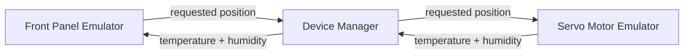

# Reference Application Spec

## Attribution

This reference application is adapted from a subset of an exercise created by **Allen C. Smith** for his Actor Framework workshop at **GDevCon N.A. 2026**. It has been scoped down and generalized here so it can serve as a common reference implementation across multiple LabVIEW architectures, not just the Actor Framework. Full credit for the original exercise design goes to Allen — if you're one of his workshop attendees, this will look familiar.

## Purpose

Every framework folder in this repository implements **this exact application**. The point isn't the application itself — it's deliberately small — the point is that the same requirements, implemented in NI QMH, JKI State Machine, JKI SMO, DQMH, Actor Framework, Workers, DCAF, and the rest, let a reader compare architectures on equal footing: same behavior, same data, same UI, different internal plumbing.

An implementation is spec-compliant if it satisfies every requirement below. Anything not specified here is an implementation detail left to the framework author's judgment.

## System Architecture

The application is composed of **three independent, asynchronous processes**. Each runs in parallel and does not block the others.



| Process | Role |
|---|---|
| **Servo Motor Emulator** | Simulates a physical servo motor: accepts a requested position, displays it, and reports telemetry data|
| **Front Panel Emulator** | Simulates the operator-facing panel: lets the user request a position, displays telemetry data|
| **Device Manager** | Owns both emulators and mediates all communication between them — neither emulator talks to the other directly |

This three-process shape is the one architectural requirement every implementation must preserve. How each process is internally built (loops, queues, classes, actors, workers, tags, etc.) is entirely up to the framework being demonstrated.

## Process Specifications

### 1. Servo Motor Emulator

A front panel that emulates a physical servo motor, including basic telemetry.


**Must have:**
- A **dial indicator**, labeled "Position," displaying the current requested position on a **0 to 180** scale
- A **numeric control**, labeled "Temperature," that lets whoever is operating the emulator manually set the value it reports — there's no real sensor behind this, so a human stands in for one
- A **numeric control**, labeled "RH," used the same way for Relative Humidity

Whatever value is currently set in these two controls is what the Servo Motor Emulator reports to the Device Manager.

**Receives from Device Manager:**
- Requested position (updates the dial)

**Sends to Device Manager:**
- Temperature
- Relative Humidity

### 2. Front Panel Emulator

A front panel that emulates the panel an operator would interact with.


**Must have:**
- A **knob control**, labeled "Position," the user turns to request a position for the servo motor, on the same **0 to 180** scale as the Servo Motor Emulator's dial
- A **string indicator** labeled "LCD," displaying the Position, Temperature, and Relative Humidity reported back from the Servo Motor Emulator, formatted as:
  ```
  Position: 82
  Temp: 25.0 RH: 50
  ```

**Sends to Device Manager:**
- Requested position (whenever the user moves the knob)

**Receives from Device Manager:**
- Temperature
- Relative Humidity

### 3. Device Manager

Not a UI-facing process — it owns (and may launch) the other two and mediates all communication between them.

**May:**
- Launch and manage the lifecycle of both the Servo Motor Emulator and the Front Panel Emulator

**Must:**
- Relay the requested position from the Front Panel Emulator to the Servo Motor Emulator
- Relay Temperature and Relative Humidity from the Servo Motor Emulator to the Front Panel Emulator
- Contain no direct dependency between the two emulators — they should be swappable independently (see [Phase 2](#phase-2-hardware-swap-in-future-work))

## Design Constraints

- **Three async processes** The whole point is parallel, message-driven communication.
- **No direct emulator-to-emulator communication.** All data flows through the Device Manager. This is what makes the Phase 2 hardware swap possible without touching the other emulator or the Device Manager's core logic.
- **Framework-idiomatic, not spec-contorted.** Use whatever internal IPC mechanism is natural for the framework being demonstrated (DQMH events, AF messages, a hand-wired queue for the pattern-level examples, a Tag Bus for DCAF, etc.) — the spec defines behavior and boundaries, not implementation.

## Acceptance Criteria

An implementation is considered complete when:

- [ ] All three processes run concurrently and independently
- [ ] Turning the knob on the Front Panel Emulator updates the dial on the Servo Motor Emulator
- [ ] Temperature and Relative Humidity generated by the Servo Motor Emulator are visible on the Front Panel Emulator's string indicator
- [ ] Neither emulator has a direct reference to, or dependency on, the other
- [ ] The Device Manager can start and stop both emulators cleanly (no orphaned processes on exit)
- [ ] The implementation's folder `README.md` documents LabVIEW version, framework/dependency versions, and how to run it

## Phase 2: Hardware Swap-In (Future Work)

Once the base (all-emulator) implementations exist, a second phase will replace the **Servo Motor Emulator** and/or **Front Panel Emulator** with modules that drive real hardware, while keeping the same public API the Device Manager already talks to. This is meant to illustrate, concretely, what it takes to swap one module for another under each framework — how much of the Device Manager (and the rest of the app) has to change, if anything.

This phase is not yet scoped in detail. If you're implementing a framework now, favor a clean, well-defined public interface for each emulator, since that boundary is exactly what Phase 2 will exercise.